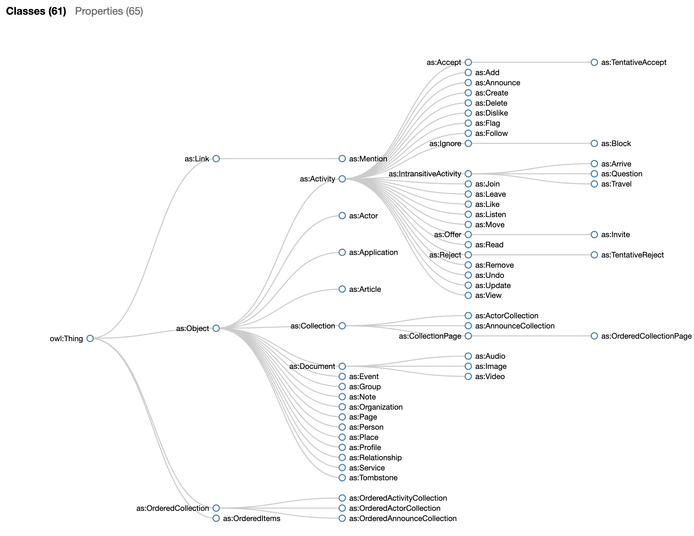

# ActivityPub / Mastodon Ontologies

This ontology is an *unofficial* version of an [ActivityPub](https://www.w3.org/TR/activitypub/) [OWL](https://www.w3.org/TR/owl-ref/#Individual) ontology for experimentation and exploration purposes. It's based on an old [Activity Streams](https://www.w3.org/TR/activitystreams-core/) [ontology](https://github.com/w3c/activitystreams/blob/master/vocabulary/activitystreams2.owl) that was abandoned in favor of JSON-LD in ActivityPub. I also created a separate ontology for Mastodon (toot) extensions.

The ontology is represented in the [RDF Turtle format](https://www.w3.org/TR/turtle/). It can be viewed and browsed in tools like [Protégé](https://protege.stanford.edu/).

## Changes to the original AS ontology

* Deprecated terms from the original Activity Streams ontology have been removed. 
* Activity Pub extensions have been added to the Activity Streams namespace to be compatible with the Activity Streams JSON-LD context.
* An `Actor` class has been added. Any `Object` with an `inbox` is an `Actor`.
* I've added type-restricted collections (e.g. `OrderedActivityCollection`).
* The OWL range for `as:url` is challenging because the specification defines it as a union of a class (`Object`) and a data type (`xsd::anyURI`). I'm not sure how to model that in OWL or if it's even possible. 

## Disclaimer

I'm not an ontology engineer so I make no claims that this is the best way (or even a good one) to represent the ontologies. I'm using this for my own purposes and releasing it in case someone else has a use for it (or wants to collaborate on improving it).

## References

* [ActivityPub](https://www.w3.org/TR/activitypub/)
* [Activity Streams 2.0](https://www.w3.org/TR/activitystreams-core/)
* [Activity Vocabulary](https://www.w3.org/TR/activitystreams-vocabulary/)
* [Activity Streams 2.0 JSON-LD Context](https://www.w3.org/ns/activitystreams.jsonld)
* [Original Activity Streams 2 OWL Ontology (abandoned in 2016)](https://github.com/w3c/activitystreams/blob/master/vocabulary/activitystreams2.owl)
* [OWL Web Ontology Language Reference](https://www.w3.org/TR/owl-ref/#Individual)
* [RDF 1.1 Turtle](https://www.w3.org/TR/turtle/)
* [Protégé Ontology Editor and Framework](https://protege.stanford.edu/)

